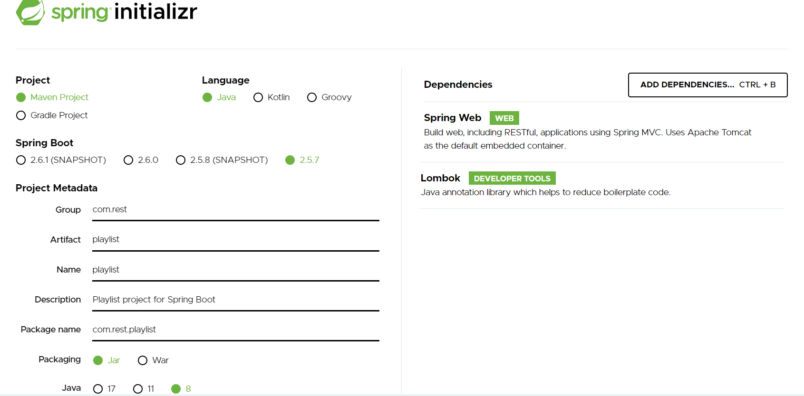
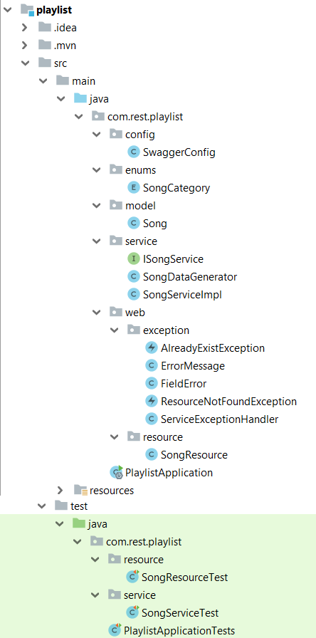
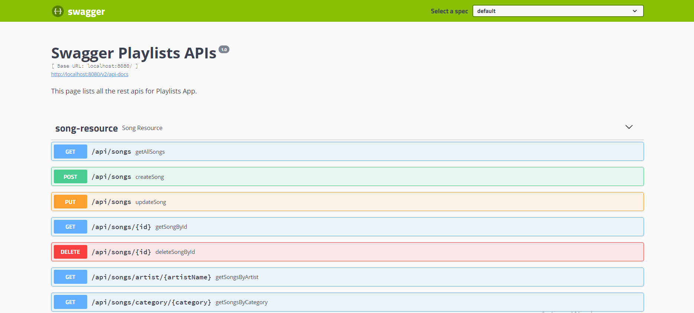

# Spring Boot Rest Api - Playlists
Dans ce tutoriel, nous allons écrire un service CRUD REST Spring Boot simple basé sur un statut HTTP bien utilisé et entièrement couvert par des tests.

Nous allons créer une API Spring Boot Rest CRUD pour une application de playlist dans les termes suivants :

* Chaque Song a un identifiant, un titre, une description, une catégorie, une durée et un nom de l’artiste

* Apis aide à créer, récupérer, mettre à jour, supprimer des Song.

* Apis prend également en charge les méthodes de recherche personnalisées ou ce qu'on appelle "query methods " telles que la recherche par catégorie ou par artiste.
##### Points de terminaison d’API
- Les codes de réponse HTTP: 

* **200 Success** : La demande a réussi
* **201 Created** : La demande a été satisfaite et a entraîné la création d'une nouvelle ressource
* **204 No Content** : La demande a répondu à la demande mais n'a pas besoin de retourner un corps d'entité
* **400 Bad Request** : La requête n'a pas pu être comprise par le serveur en raison d'une syntaxe mal formée
* **404 Not Found** : Le serveur n'a rien trouvé correspondant à l'URI de la requête
* **409 Conflict** : La demande n'a pas pu être traitée en raison d'un conflit avec l'état actuel de la ressource

| Méthode HTTP | URI | Description | Codes d'états http |
| ------------- | ------------- | ------------- | ------------- |
| POST  | /api/songs  | Créer une chanson  | 201, 409  |
| PUT  | /api/songs/{id}  | Modifier une chanson  | 200, 409  |
| GET  | /api/songs/{id}  | Récupérer une chanson | 200, 404  |
| GET  | /api/songs  | Récupérer toutes les chansons  | 200  |
| GET  | /api/songs/category/{category} | Récupérer toutes les chansons par catégorie  | 200, 404  |
| GET  | /api/songs/artist/{artistName} | Récupérer toutes les chansons par nom d'artiste  | 200  |
| DELETE  | /api/songs/{id}  | Supprimer une chanson | 204  |

##### Spring Boot
Spring Boot est un projet Spring qui facilite le processus de configuration et de publication des applications.

En suivant des étapes simples, vous pourrez exécuter votre premier projet.

##### API REST (Representational State Transfer Application Program Interface)
Il se base sur le protocole **HTTP** pour transférer des informations. 
Un client lance une requête HTTP, et le serveur renvoie une réponse à travers plusieurs méthodes dont les plus utilisées sont : **POST**, **GET**, **PUT** et **DELETE**.

##### Outils utilisés : 
* Java 8
* IDE Intellij IDEA
* Spring Boot 2.5.7 (avec Spring Web MVC)
* Lombok 1.18.22
* Maven 4.0.0

## I. Initialisation du projet
Pour amorcer une application Spring Boot , nous pouvons démarrer le projet à partir de zéro avec notre IDE préféré, ou simplement utiliser un autre moyen qui facilite la vie : [SpringInitializr](https://start.spring.io/)

Initialement, nous avons choisi la dépendance Spring web et lombok.



## II. Structure du projet
L'image ci-dessous montre la structure finale du projet



## III.	Implémentation d'une API Rest
* **Pom.xml**

Contient des dépendances pour Spring Boot. Dans notre cas, nous sommes besoin de ces dépendances.

```xml
	 <dependencies>
            <dependency>
                <groupId>org.springframework.boot</groupId>
                <artifactId>spring-boot-starter-web</artifactId>
            </dependency>
            <dependency>
                <groupId>org.springframework.boot</groupId>
                <artifactId>spring-boot-starter-test</artifactId>
                <scope>test</scope>
            </dependency>
            <dependency>
                <groupId>io.springfox</groupId>
                <artifactId>springfox-swagger2</artifactId>
                <version>2.9.2</version>
            </dependency>
            <dependency>
                <groupId>io.springfox</groupId>
                <artifactId>springfox-swagger-ui</artifactId>
                <version>2.9.2</version>
            </dependency>
            <dependency>
                <groupId>org.springframework.boot</groupId>
                <artifactId>spring-boot-starter-validation</artifactId>
            </dependency>
            <dependency>
                <groupId>junit</groupId>
                <artifactId>junit</artifactId>
                <scope>test</scope>
            </dependency>
            <dependency>
                <groupId>org.apache.commons</groupId>
                <artifactId>commons-lang3</artifactId>
                <version>3.9</version>
            </dependency>
            <dependency>
                <groupId>org.projectlombok</groupId>
                <artifactId>lombok</artifactId>
                <version>1.18.22</version>
            </dependency>
     </dependencies>
```

* **Main Class**

C’est la classe principale de l’application et appelée aussi une classe de démarrage.

L ’adresse par défaut d’exécution : http://localhost:8080 

```java 
@SpringBootApplication
public class PlaylistApplication {

	public static void main(String[] args) {
		SpringApplication.run(PlaylistApplication.class, args);
	}

}
```

* **Package « model »**

Dans le package de modèle, nous définissons la classe **Song**

**Song.java**

Cette classe regroupe les propriétés suivantes : Id, title, description, category, duration, artistName

Ici, nous allons utiliser **Lombok** : est une bibliothèque Java qui se connecte automatiquement à un éditeur afin de générer automatiquement les méthodes getter ou equals à l'aide des annotations.

* **@Getter / @Setter** :  pour générer automatiquement le getter/setter par défaut.
* **@Builder** : nous permet de produire automatiquement le code requis pour que la classe soit instanciable et aussi pour éviter la complexité des constructeurs

```java 
@Getter
@Setter
public class Song {

    private static final AtomicInteger count = new AtomicInteger(0);

    private int id;

    @NotBlank(message = "titre ne doit pas être null ou vide")
    @Size(min = 3, max = 50, message = "titre doit être compris entre 3 et 50 caractères")
    private String title;

    @NotBlank(message = "description ne doit pas être nulle ou vide")
    @Size(min = 3, max = 50, message = "description doit être compris entre 3 et 50 caractères")
    private String description;

    @NotNull(message = "categorie<JAZZ, POP, CLASSICAL> ne doit pas être nulle")
    private SongCategory category;

    @NotBlank(message = "duration ne doit pas être nulle ou vide")
    private String duration;

    @NotBlank(message = "artistname ne doit pas être null ou vide")
    private String artistName;

    @Builder
    private Song(String title, String description, SongCategory category, String duration, String artistName) {
        this.id = count.incrementAndGet();
        this.title = title;
        this.description = description;
        this.category = category;
        this.duration = duration;
        this.artistName = artistName;
    }
}

```

* **Package « enums »**
Ce package contient une classe nommée « **SongCategory** » qui contient les différentes valeurs possibles d’une catégorie.

```java 
public enum SongCategory {
    JAZZ,
    CLASSICAL,
    POP
}
```

* **Package « service »**

Ce package contient :

 L’interface « **ISongService** » qui contient des méthodes qui vont être par la suite gérées par le contrôleur

```java 
public interface ISongService {

    List<Song> getAllSongs();
    List<Song> getSongsByCategory(String category);
    List<Song> getSongsByArtistName(String artistName);
    Song getSongById(int id);
    Song createSong(Song playlist);
    void updateSong(Song playlist);
    void deleteSongById(int id);
}
```

La classe « **SongDataGenerator** » qui contient une liste de chansons

⇨	Dans ce tutoriel, nous allons travailler avec des données non sauvegardées dans une base des données c’est-à-dire aucune interaction avec la base de données. Pour cela, nous devons déclarer une liste **mySongs** de type Song tout en respectant le principe thread-safe en java tels que :
- **CopyOnWriteArrayList** est une variante thread-safe d'ArrayList. A l'instar d’ArrayList, **CopyOnWriteArray** gère un tableau pour stocker ses éléments. La différence est que toutes les opérations telles que add, set, remove, clear, etc... créent une nouvelle copie du tableau qu'elle gère.

**Thread-safe** : signifie simplement que le code peut être utilisé à partir de plusieurs threads en même temps sans causer de problèmes et en toute sécurité.

```java 
@Getter
class SongDataGenerator {
    private CopyOnWriteArrayList<Song> data = new CopyOnWriteArrayList<>(new Song[]{
            Song.builder()
                    .title("The Falls")
                    .description("Album musical d'Ennio Morricone")
                    .category(SongCategory.CLASSICAL)
                    .duration("7:10")
                    .artistName("Morricone")
                    .build(),

            Song.builder()
                    .title("Oblivion")
                    .description("Album musical d'Astor Piazzolla")
                    .category(SongCategory.CLASSICAL)
                    .duration("6:05")
                    .artistName("Piazzolla")
                    .build(),

            Song.builder()
                    .title("14 Romances")
                    .description("Album musical de Sergueï Rachmaninov")
                    .category(SongCategory.CLASSICAL)
                    .duration("7:00")
                    .artistName("Rachmaninov")
                    .build(),

            Song.builder()
                    .title("For The Lover That I Lost")
                    .description("Live At Abbey Road Studios")
                    .category(SongCategory.POP)
                    .duration("3:01")
                    .artistName("Sam Smith")
                    .build(),

            Song.builder()
                    .title("Burning")
                    .description("Burning Hackney Round Chapel")
                    .category(SongCategory.POP)
                    .duration("4:05")
                    .artistName("Sam Smith")
                    .build(),

            Song.builder()
                    .title("I'll Play The Blues For You")
                    .description("No Surrender")
                    .category(SongCategory.JAZZ)
                    .duration("7:42")
                    .artistName("Daniel Castro")
                    .build(),


            Song.builder()
                    .title("Blues In My Bottle")
                    .description("Boogie Woogie and Some Blues")
                    .category(SongCategory.JAZZ)
                    .duration("7:03")
                    .artistName("Christian Willisohn")
                    .build()
    });
}
```

La classe « **SongService** » qui contient l’implémentation de méthodes de « **ISongService** »

Cette classe doit être annotée avec **@Service**

- La méthode **verifyIfSongExist** throw une exception si le titre et la catégorie de la chanson à créer/modifier sont déjà utilisés.

```java
@Service
public class SongServiceImpl implements ISongService {
    private static final Logger log = LoggerFactory.getLogger(SongServiceImpl.class);

    private CopyOnWriteArrayList<Song> mySongs = new SongDataGenerator().getData();

    @Override
    public List<Song> getAllSongs() {
        return mySongs;
    }

    @Override
    public List<Song> getSongsByCategory(String category) {
        SongCategory songCategory = EnumUtils.getEnumIgnoreCase(SongCategory.class, category);
        if (songCategory == null) {
            throw new ResourceNotFoundException("Not found Category with value = " + category);
        }

        return mySongs.stream().filter(s -> s.getCategory() == songCategory).collect(Collectors.toList());
    }

    @Override
    public List<Song> getSongsByArtistName(String name) {
        return mySongs.stream()
                .filter(s -> s.getArtistName().toUpperCase().contains(name.toUpperCase()))
                .collect(Collectors.toList());
    }

    @Override
    public Song getSongById(int id) {
        return mySongs.stream()
                .filter(p -> id == p.getId())
                .findAny()
                .orElseThrow(() -> new ResourceNotFoundException("Not found Song with id = " + id));
    }

    @Override
    public Song createSong(Song song) {
        verifyIfSongExist(song);
        mySongs.add(song);
        return song;
    }

    @Override
    public void updateSong(Song song) {
        verifyIfSongExist(song);

        Song foundedSong = getSongById(song.getId());
        foundedSong.setTitle(song.getTitle());
        foundedSong.setDescription(song.getDescription());
        foundedSong.setCategory(song.getCategory());
        foundedSong.setDuration(song.getDuration());
        foundedSong.setArtistName(song.getArtistName());
    }

    @Override
    public void deleteSongById(int id) {
        Song foundedSong = getSongById(id);
        mySongs.remove(foundedSong);
    }

    private void verifyIfSongExist(Song song) {
        Song searchedSong = mySongs.stream()
                .filter(s -> StringUtils.equals(s.getTitle(), song.getTitle()) &&
                        s.getCategory() == song.getCategory() && (s.getId() != song.getId())
                )
                .findAny()
                .orElse(null);
        if (searchedSong != null) {
            throw new AlreadyExistException("Song Already Exists.");
        }
    }
}
```

* **Package « resource »**

Il existe sous le package **web**.

Nous avons créé la classe « **SongResource** » qui contient les différentes requêtes HTTP en injectant par contracteur la classe service « **ISongService** ».
Ce contrôleur doit être annoté avec **@RestController**.
    -	L’annotation @RestController combine les deux annotations : **@Controller** et **@ResponseBody**
    -	L’annotation @RestController est utilisée pour définir un contrôleur et pour indiquer que la valeur de retour des méthodes doit être liée au corps de la réponse Web.
    -	 **@RequestMapping("/api/songs")** déclare que toutes les URL d'Apis dans le contrôleur commenceront par /api/songs.
    -	 Chaque méthode doit être annotée avec l'une de ces annotations: **@GetMapping, @PostMapping, @DeleteMapping ou @PutMapping**.
    
```java
@RestController
@RequestMapping("/api/songs")
public class SongResource {

    final private ISongService ISongService;
    private static final Logger log = LoggerFactory.getLogger(SongServiceImpl.class);

    public SongResource(ISongService ISongService) {
        this.ISongService = ISongService;
    }

    @GetMapping
    public ResponseEntity<List<Song>> getAllSongs() {

        return new ResponseEntity<>(ISongService.getAllSongs(), HttpStatus.OK);
    }


    @GetMapping("/category/{category}")
    public ResponseEntity<List<Song>> getSongsByCategory(@PathVariable String category) {
        List<Song> songs = ISongService.getSongsByCategory(category);
        return new ResponseEntity<>(songs, HttpStatus.OK);
    }


    @GetMapping("/artist/{artistName}")
    public ResponseEntity<List<Song>> getSongsByArtistName(@PathVariable String artistName) {
        List<Song> songs = ISongService.getSongsByArtistName(artistName);
        return new ResponseEntity<>(songs, HttpStatus.OK);
    }

    @GetMapping("/{id}")
    public ResponseEntity<Song> getSongById(@PathVariable int id) {
        Song song = ISongService.getSongById(id);
        return new ResponseEntity<>(song, HttpStatus.OK);
    }

    @PostMapping
    public ResponseEntity<Song> createSong(@Valid @RequestBody Song song) {
        Song addedSong = ISongService.createSong(song);
        return new ResponseEntity<>(addedSong, HttpStatus.CREATED);
    }


    @PutMapping
    public ResponseEntity updateSong(@Valid @RequestBody Song song) {
        ISongService.updateSong(song);
        return new ResponseEntity<>(song, HttpStatus.OK);
    }

    @DeleteMapping("/{id}")
    public ResponseEntity deleteSongById(@PathVariable int id) {
        ISongService.deleteSongById(id);
        return new ResponseEntity<>(HttpStatus.NO_CONTENT);
    }
}
```

* **Exécuter et tester l’application**

Pour tester les requêtes de l’application, vous devez importer le fichier « **Playlists.postman_collection.json** » qui existe sous le dossier resources/postman.


Quelques exemples de test : **{{url}} = http://localhost:8080**


* **Documentation des API Spring Rest à l'aide de Swagger : Package « config »**

 Swagger est le framework d'API le plus populaire avec une prise en charge de plus de 40 langues différentes. Nous pouvons utiliser swagger pour concevoir, construire et documenter nos REST API.
 
 ```java
@Configuration
@EnableSwagger2
public class SwaggerConfig {

    @Bean
    public Docket api() {

        return new Docket(DocumentationType.SWAGGER_2)
                .apiInfo(apiInfo())
                .select()
                .apis(RequestHandlerSelectors.any())
                .paths(paths()::test)
                .build();

    }

    private ApiInfo apiInfo() {
        return new ApiInfoBuilder()
                .title("Swagger Playlists APIs")
                .description("This page lists all the rest apis for Playlists App.")
                .version("1.0")
                .build();
    }


    private Predicate<String> paths() {
        return ((Predicate<String>) regex("/error.*")::apply).negate()
                .and(regex("/.*")::apply);
    }
}
```

Utiliser cette url : **http://localhost:8080/swagger-ui.html**



## IV. Validation de données
* **Bean Validation**

 En Spring boot, Bean Validation fonctionne en définissant des contraintes sur les champs d'une classe en les annotant avec certaines annotations.
 Dans notre cas, nous avons utilisé les annotations suivantes :
 
 * @NotNull : pour dire qu'un champ ne doit pas être nul.
 * @NotEmpty : pour dire qu'un champ ne doit pas être nul et ne doit pas être vide.
 * @Size : pour préciser la longueur minimale et/ou maximale de champ avec/sans un message d'erreur

⇒ L’annotation @Size seule n’est pas suffisante pour ne pas mettre la valeur nulle ⇒ il vaut mieux ajouter l’annotation @NotNull

```
    @NotBlank(message = "titre ne doit pas être null ou vide")
    @Size(min = 3, max = 50, message = "titre doit être compris entre 3 et 50 caractères")
    private String title;

    @NotBlank(message = "description ne doit pas être nulle ou vide")
    @Size(min = 3, max = 50, message = "description doit être compris entre 3 et 50 caractères")
    private String description;

    @NotNull(message = "categorie<JAZZ, POP, CLASSICAL> ne doit pas être nulle")
    private SongCategory category;

    @NotBlank(message = "duration ne doit pas être nulle ou vide")
    private String duration;

    @NotBlank(message = "artistname ne doit pas être null ou vide")
    private String artistName;
```
 * @Valid : pour indiquer à Spring que nous voulons qu'un paramètre ou un champ de méthode soit validé par exemple : Pour valider le corps de la requête HTTP, nous annotons le corps de la requête avec l'annotation @Valid dans un contrôleur REST :
```
@PostMapping
    public ResponseEntity<Song> createSong(@Valid @RequestBody Song song) {
        Song addedSong = ISongService.createSong(song);
        return new ResponseEntity<>(addedSong, HttpStatus.CREATED);
    }
```

* **Gestion des exceptions : créer une exception personnalisée**

**Package « exception »**

Il existe sous le package **web**.

* **@Builder** : nous permet de produire automatiquement le code requis pour que la classe soit instanciable et aussi pour éviter la complexité des constructeurs

* La classe **ErrorMessage**

```java
/**
 * instead of using default error response provided by Spring Boot,
 * we define a specific error response message
 * response eg :
 * {
 *     "statusCode": 400,
 *     "timeStamp": "2021-12-11T22:35:50.035+00:00",
 *artist
 *     "description": "uri=/api/songs",
 *     "fieldErrors": [
 *         {
 *             "objectName": "song",
 *             "field": "title",
 *             "message": "NotBlank: titre ne doit pas être null ou vide"
 *         }
 *     ]
 * }
 */


@Getter
@Builder
class ErrorMessage {

    private int statusCode;
    private Date timeStamp;
    private String message;
    private String description;
    private List<FieldError> fieldErrors;
}
```

* La classe **FieldError**

```java
/**
 * instead of using default error response provided by Spring Boot,
 * FieldError class is part of ErrorMessage class to definr error response message
 */

@Getter
@Builder
class FieldError {

    private String objectName;

    private String field;

    private String message;
}

```

Spring prend en charge la gestion des exceptions par :
-	Un gestionnaire d'exceptions global (@ExceptionHandler )
-	Controller Advice (@ControllerAdvice )

L’annotation @ControllerAdvice est la spécialisation de l’annotation @Component afin qu'elle soit détectée automatiquement via l'analyse du chemin de classe. Un Conseil de Contrôleur est une sorte d'intercepteur qui entoure la logique de nos Contrôleurs et nous permet de leur appliquer une logique commune.

Les méthodes (annotées avec @ExceptionHandler) sont partagées globalement entre plusieurs composants @Controller pour capturer les exceptions et les traduire en réponses HTTP.

L’annotation @ExceptionHandler indique quel type d'exception nous voulons gérer. L'instance exception et le request seront injectés via des arguments de méthode.
 
 ⇨	En utilisant deux annotations ensemble, nous pouvons : contrôler le corps de la réponse avec le code d'état et gérer plusieurs exceptions dans la même méthode.

* Nous allons lancer une exception pour la ressource introuvable dans le contrôleur Spring Boot.Créons une classe ResourceNotFoundException qui étend RuntimeException.

```java
/**
 * ResourceNotFoundException class extends RuntimeException.
 * It's about a custom exception :
 * throwing an exception for resource not found in Spring Boot Service
 * ResourceNotFoundException is thrown with Http 404
 */

public class ResourceNotFoundException extends RuntimeException {

    public ResourceNotFoundException(String message) {
        super(message);
    }
}
```
* Nous allons lancer une exception pour la ressource qui existe déjà dans le contrôleur Spring Boot. Créons une classe AlreadyExistException qui étend RuntimeException.

```java
/**
 * AlreadyExistException class extends RuntimeException.
 * It's about a custom exception :
 * throwing an exception for resource already exist (conflict) in Spring Boot Service
 * AlreadyExistException is thrown with Http 409
 */

public class AlreadyExistException extends RuntimeException {

    public AlreadyExistException(String message) {
        super(message);
    }
}
```
* La classe ServiceExceptionHandler gère trois exceptions spécifiques (ResoureNotFoundException, AlreadyExistException et MethodArgumentNotValidException) et les exceptions globales à un seul endroit.
 
```java
@ControllerAdvice
public class ServiceExceptionHandler {

    private static final Logger log = LoggerFactory.getLogger(SongServiceImpl.class);


    @ExceptionHandler(ResourceNotFoundException.class)
    public ResponseEntity<ErrorMessage> handleResourceNotFoundException(ResourceNotFoundException e, WebRequest request) {
        ErrorMessage message = ErrorMessage.builder()
                .statusCode(HttpStatus.NOT_FOUND.value())
                .timeStamp(new Date())
                .message(e.getMessage())
                .description(request.getDescription(false))
                .build();

        return new ResponseEntity<>(message, HttpStatus.NOT_FOUND);
    }

    @ExceptionHandler(AlreadyExistException.class)
    public ResponseEntity<ErrorMessage> handleAlreadyExistException(AlreadyExistException e, WebRequest request) {
        ErrorMessage message = ErrorMessage.builder()
                .statusCode(HttpStatus.NOT_ACCEPTABLE.value())
                .timeStamp(new Date())
                .message(e.getMessage())
                .description(request.getDescription(false))
                .build();
        return new ResponseEntity<>(message, HttpStatus.NOT_ACCEPTABLE);
    }

    @ExceptionHandler(MethodArgumentNotValidException.class)
    public final ResponseEntity<ErrorMessage> handleArgumentNotValidException(MethodArgumentNotValidException e, WebRequest request) {

        BindingResult result = e.getBindingResult();
        List<FieldError> fieldErrors = result.getFieldErrors().stream()
                .map(f -> FieldError.builder()
                        .objectName(f.getObjectName())
                        .field(f.getField())
                        .message(f.getCode() + ": " + f.getDefaultMessage())
                        .build())
                .collect(Collectors.toList());

        ErrorMessage message = ErrorMessage.builder()
                .statusCode(HttpStatus.BAD_REQUEST.value())
                .timeStamp(new Date())
                .message(e.getMessage())
                .description(request.getDescription(false))
                .fieldErrors(fieldErrors)
                .build();
        return new ResponseEntity<>(message, HttpStatus.BAD_REQUEST);
    }

    @ExceptionHandler(Exception.class)
    public ResponseEntity<ErrorMessage> globalException(Exception e, WebRequest request) {
        ErrorMessage message = ErrorMessage.builder()
                .statusCode(HttpStatus.INTERNAL_SERVER_ERROR.value())
                .timeStamp(new Date())
                .message(e.getMessage())
                .description(request.getDescription(false))
                .build();

        return new ResponseEntity<>(message, HttpStatus.INTERNAL_SERVER_ERROR);
    }
}
```

* **Tester les exception avec postman**

 

 

 

## V. Tests Unitaires
Le test unitaire consiste à isoler une partie du code et à vérifier qu’il fonctionne parfaitement. Il s’agit de petits tests qui valident l’attitude d’un objet et la logique du code.

* **Resource** 
```java
@RunWith(SpringRunner.class)
@WebMvcTest(SongResource.class)
public class SongResourceTest {
    private static final Logger log = LoggerFactory.getLogger(SongResourceTest.class);

    @Autowired
    private MockMvc mockMvc;

    @MockBean
    private ISongService songService;
    private Song mySong = Song.builder()
            .title("test Song #1")
            .description("test description Song #1")
            .category(SongCategory.CLASSICAL)
            .duration("3:01")
            .artistName("artist1")
            .build();

    private CopyOnWriteArrayList<Song> songs = new CopyOnWriteArrayList<>(new Song[]{
            Song.builder()
                    .title("test Song #2")
                    .description("test description Song #2")
                    .category(SongCategory.CLASSICAL)
                    .duration("3:03")
                    .artistName("artist2")
                    .build()});

    @Test
    public void testGetSongs() throws Exception {

        given(songService.getAllSongs()).willReturn(songs);
        mockMvc.perform(get("/api/songs")
                .contentType(MediaType.APPLICATION_JSON))
                .andExpect(status().isOk())
                .andExpect(jsonPath("$", hasSize(1)))
                .andExpect(jsonPath("$[*].title").value(songs.get(0).getTitle()))
                .andExpect(jsonPath("$[*].description").value(songs.get(0).getDescription()))
                .andExpect(jsonPath("$[*].category").value(songs.get(0).getCategory().toString()))
                .andExpect(jsonPath("$[*].artistName").value(songs.get(0).getArtistName()))
                .andExpect(jsonPath("$[*].duration").value(songs.get(0).getDuration()));
    }

    @Test
    public void testGetSongsByCategory() throws Exception {
        given(songService.getSongsByCategory(mySong.getCategory().toString())).willReturn(songs);
        mockMvc.perform(get("/api/songs/category/" + mySong.getCategory().toString())
                .contentType(MediaType.APPLICATION_JSON))
                .andExpect(status().isOk())
                .andExpect(jsonPath("$", hasSize(1)))
                .andExpect(jsonPath("$[*].title").value(songs.get(0).getTitle()))
                .andExpect(jsonPath("$[*].description").value(songs.get(0).getDescription()))
                .andExpect(jsonPath("$[*].category").value(songs.get(0).getCategory().toString()))
                .andExpect(jsonPath("$[*].artistName").value(songs.get(0).getArtistName()))
                .andExpect(jsonPath("$[*].duration").value(songs.get(0).getDuration()));
    }

    @Test
    public void testGetSongsWithNonExistingCategory() throws Exception {
        doThrow(new ResourceNotFoundException("Not found Category with value = popy")).when(songService).getSongsByCategory("popy");
        mockMvc.perform(get("/api/songs/category/popy")
                .contentType(MediaType.APPLICATION_JSON))
                .andExpect(status().is4xxClientError())
                .andExpect(jsonPath("message").value("Not found Category with value = popy"));
    }

    @Test
    public void testGetEmptyListSongsByCategory() throws Exception {
        mockMvc.perform(get("/api/songs/category/POP")
                .contentType(MediaType.APPLICATION_JSON))
                .andExpect(status().isOk())
                .andExpect(jsonPath("$", hasSize(0)));
    }

    @Test
    public void testGetSongsByArtistName() throws Exception {
        given(songService.getSongsByArtistName(songs.get(0).getArtistName())).willReturn(songs);
        mockMvc.perform(get("/api/songs/artist/" + songs.get(0).getArtistName())
                .contentType(MediaType.APPLICATION_JSON))
                .andExpect(status().isOk())
                .andExpect(jsonPath("$", hasSize(1)))
                .andExpect(jsonPath("$[*].title").value(songs.get(0).getTitle()))
                .andExpect(jsonPath("$[*].description").value(songs.get(0).getDescription()))
                .andExpect(jsonPath("$[*].category").value(songs.get(0).getCategory().toString()))
                .andExpect(jsonPath("$[*].artistName").value(songs.get(0).getArtistName()))
                .andExpect(jsonPath("$[*].duration").value(songs.get(0).getDuration()));
    }

    @Test
    public void testGetEmptyListSongsArtistName() throws Exception {
        mockMvc.perform(get("/api/songs/artist/sam")
                .contentType(MediaType.APPLICATION_JSON))
                .andExpect(status().isOk())
                 .andExpect(jsonPath("$", hasSize(0)));
    }

    @Test
    public void testGetSongById() throws Exception {
        given(songService.getSongById(mySong.getId())).willReturn(mySong);
        mockMvc.perform(get("/api/songs/" + mySong.getId())
                .contentType(MediaType.APPLICATION_JSON))
                .andExpect(status().isOk())
                .andExpect(jsonPath("$.id").value(mySong.getId()))
                .andExpect(jsonPath("$.title").value(mySong.getTitle()))
                .andExpect(jsonPath("$.description").value(mySong.getDescription()))
                .andExpect(jsonPath("$.category").value(mySong.getCategory().toString()))
                .andExpect(jsonPath("$.artistName").value(mySong.getArtistName()))
                .andExpect(jsonPath("$.duration").value(mySong.getDuration()));

    }

    @Test
    public void testGetSongByNonExistingId() throws Exception {
        doThrow(new ResourceNotFoundException("Not found Song with id = 10000")).when(songService).getSongById(10000);
        mockMvc.perform(get("/api/songs/10000")
                .contentType(MediaType.APPLICATION_JSON))
                .andExpect(status().is4xxClientError())
                .andExpect(jsonPath("message").value("Not found Song with id = 10000"));
    }

    @Test
    public void testCreateSong() throws Exception {
        when(songService.createSong(mySong)).thenReturn(mySong);
        mockMvc.perform(post("/api/songs")
                .contentType(MediaType.APPLICATION_JSON)
                .accept(MediaType.APPLICATION_JSON)
                .content(asJsonString(mySong)))
                .andExpect(status().isCreated());
    }

    @Test
    public void testCreateSongWithTitleSizeLessThanThree() throws Exception {
        mySong.setTitle("S");
        doThrow(new ResourceNotFoundException("Size: titre doit être compris entre 3 et 50 caractères")).when(songService).createSong(mySong);
        mockMvc.perform(post("/api/songs")
                .contentType(MediaType.APPLICATION_JSON)
                .accept(MediaType.APPLICATION_JSON)
                .content(asJsonString(mySong)))
                .andExpect(status().is4xxClientError())
                .andExpect(jsonPath("fieldErrors[0].message").value("Size: titre doit être compris entre 3 et 50 caractères"));
    }

    @Test
    public void testCreateSongWithDescriptionSizeLessThanThree() throws Exception {
        mySong.setDescription("S");
        doThrow(new ResourceNotFoundException("Size: description doit être compris entre 3 et 50 caractères")).when(songService).createSong(mySong);
        mockMvc.perform(post("/api/songs")
                .contentType(MediaType.APPLICATION_JSON)
                .accept(MediaType.APPLICATION_JSON)
                .content(asJsonString(mySong)))
                .andExpect(status().is4xxClientError())
                .andExpect(jsonPath("fieldErrors[0].message").value("Size: description doit être compris entre 3 et 50 caractères"));
    }

    @Test
    public void testCreateSongWithTitleNull() throws Exception {
        mySong.setTitle(null);
        doThrow(new ResourceNotFoundException("NotBlank: titre ne doit pas être null ou vide")).when(songService).createSong(mySong);
        mockMvc.perform(post("/api/songs")
                .contentType(MediaType.APPLICATION_JSON)
                .accept(MediaType.APPLICATION_JSON)
                .content(asJsonString(mySong)))
                .andExpect(status().is4xxClientError())
                .andExpect(jsonPath("fieldErrors[0].message").value("NotBlank: titre ne doit pas être null ou vide"));
    }

    @Test
    public void testUpdateSong() throws Exception {
        doNothing().when(songService).updateSong(mySong);
        mockMvc.perform(put("/api/songs")
                .contentType(MediaType.APPLICATION_JSON)
                .accept(MediaType.APPLICATION_JSON)
                .content(asJsonString(mySong)))
                .andExpect(status().isOk());
    }

    @Test
    public void testUpdateSongWithTitleSizeLessThanThree() throws Exception {
        mySong.setTitle("S");
        doThrow(new ResourceNotFoundException("Size: titre doit être compris entre 3 et 50 caractères")).when(songService).updateSong(mySong);
        mockMvc.perform(post("/api/songs")
                .contentType(MediaType.APPLICATION_JSON)
                .accept(MediaType.APPLICATION_JSON)
                .content(asJsonString(mySong)))
                .andExpect(status().is4xxClientError())
                .andExpect(jsonPath("fieldErrors[0].message").value("Size: titre doit être compris entre 3 et 50 caractères"));
    }

    @Test
    public void testUpdateSongWithDescriptionSizeLessThanThree() throws Exception {
        mySong.setDescription("S");
        doThrow(new ResourceNotFoundException("Size: description doit être compris entre 3 et 50 caractères")).when(songService).updateSong(mySong);
        mockMvc.perform(post("/api/songs")
                .contentType(MediaType.APPLICATION_JSON)
                .accept(MediaType.APPLICATION_JSON)
                .content(asJsonString(mySong)))
                .andExpect(status().is4xxClientError())
                .andExpect(jsonPath("fieldErrors[0].message").value("Size: description doit être compris entre 3 et 50 caractères"));
    }

    @Test
    public void testUpdateSongWithTitleNull() throws Exception {
        mySong.setTitle(null);
        doThrow(new ResourceNotFoundException("NotBlank: titre ne doit pas être null ou vide")).when(songService).updateSong(mySong);
        mockMvc.perform(post("/api/songs")
                .contentType(MediaType.APPLICATION_JSON)
                .accept(MediaType.APPLICATION_JSON)
                .content(asJsonString(mySong)))
                .andExpect(status().is4xxClientError())
                .andExpect(jsonPath("fieldErrors[0].message").value("NotBlank: titre ne doit pas être null ou vide"));
    }

    @Test
    public void testDeleteSongById() throws Exception {
        doNothing().when(songService).deleteSongById(mySong.getId());
        mockMvc.perform(delete("/api/songs/" + mySong.getId()))
                .andExpect(status().isNoContent());
    }

    @Test
    public void testDeleteNotFoundSong() throws Exception {
        doThrow(new ResourceNotFoundException("Not found Song with id = 10000")).when(songService).deleteSongById(10000);
        mockMvc.perform(delete("/api/songs/10000"))
                .andExpect(status().is4xxClientError())
                .andExpect(jsonPath("message").value("Not found Song with id = 10000"));
    }


    private static String asJsonString(final Object obj) {
        try {
            return new ObjectMapper().writeValueAsString(obj);
        } catch (Exception e) {
            throw new RuntimeException(e);
        }
    }
}
```

* **Service** 

```java
public class SongServiceTest {
    private static final Logger log = LoggerFactory.getLogger(SongServiceImpl.class);


    private SongServiceImpl playlistService;

    private Song mySong = Song.builder()
            .title("test Song #1")
            .description("test description Song #1")
            .category(SongCategory.CLASSICAL)
            .duration("3:01")
            .artistName("test artist1")
            .build();


    @Before
    public void setup() {
        playlistService = new SongServiceImpl();
    }

    @Test
    public void getSongs() {
        List<Song> songs = playlistService.getAllSongs();
        assertFalse(songs.isEmpty());
        assertThat(songs).size().isNotZero();
        assertThat(songs).contains(songs.get(0));
        assertThat(songs.get(0).getId()).isNotNull();
        assertThat(songs.get(0).getTitle()).isNotNull();
        assertThat(songs.get(0).getDescription()).isNotNull();
        assertThat(songs.get(0).getArtistName()).isNotNull();
        assertThat(songs.get(0).getDuration()).isNotNull();
        assertThat(songs.get(0).getCategory()).isNotNull();
    }

    @Test
    public void testGetSongsByCategory() {

        List<Song> songs = playlistService.getSongsByCategory("CLASSICAL");
        assertFalse(songs.isEmpty());
        assertThat(songs.get(0).getId()).isNotNull();
        assertThat(songs.get(0).getTitle()).isNotNull();
        assertThat(songs.get(0).getDescription()).isNotNull();
        assertThat(songs.get(0).getArtistName()).isNotNull();
        assertThat(songs.get(0).getDuration()).isNotNull();
        assertThat(songs.get(0).getCategory()).isNotNull();

    }

    @Test(expected = ResourceNotFoundException.class)
    public void testGetSongsWithNonExistCategory() {

        List<Song> songs = playlistService.getSongsByCategory("Popy");
        assertTrue(songs.isEmpty());
    }


    @Test
    public void testGetSongsByArtistName() {

        List<Song> songs = playlistService.getSongsByArtistName("sam");
        assertFalse(songs.isEmpty());

    }


    @Test
    public void testGetSongById() {
        List<Song> songs = playlistService.getAllSongs();
        mySong.setId(1000);
        songs.add(mySong);

        Song foundedSong = playlistService.getSongById(mySong.getId());

        assertThat(foundedSong.getId()).isNotNull();
        assertThat(foundedSong.getCategory().toString()).isEqualTo(mySong.getCategory().toString());
        assertThat(foundedSong.getDescription()).isEqualTo(mySong.getDescription());
        assertThat(foundedSong.getTitle()).isEqualTo(mySong.getTitle());
        assertThat(foundedSong.getCategory()).isEqualTo(mySong.getCategory());
        assertThat(foundedSong.getDuration()).isEqualTo(mySong.getDuration());
        assertThat(foundedSong.getArtistName()).isEqualTo(mySong.getArtistName());

    }

    @Test
    public void testCreateSong() {

        Song savedSong = playlistService.createSong(mySong);
        assertThat(savedSong).isNotNull();
        assertThat(savedSong.getId()).isNotNull();
        assertThat(savedSong.getTitle()).isEqualTo(mySong.getTitle());
        assertThat(savedSong.getDescription()).isEqualTo(mySong.getDescription());
        assertThat(savedSong.getCategory()).isEqualTo(mySong.getCategory());
        assertThat(savedSong.getDuration()).isEqualTo(mySong.getDuration());
        assertThat(savedSong.getArtistName()).isEqualTo(mySong.getArtistName());

    }

    public void testCreateExistingSongs() {
        Song savedSong = playlistService.createSong(mySong);
        assertThat(savedSong).isNotNull();
        assertThat(savedSong.getId()).isNotNull();
        assertThat(savedSong.getTitle()).isEqualTo(mySong.getTitle());
        assertThat(savedSong.getDescription()).isEqualTo(mySong.getDescription());
        assertThat(savedSong.getCategory()).isEqualTo(mySong.getCategory());
        assertThat(savedSong.getDuration()).isEqualTo(mySong.getDuration());
        assertThat(savedSong.getArtistName()).isEqualTo(mySong.getArtistName());

        AlreadyExistException ex = assertThrows(AlreadyExistException.class, () -> playlistService.createSong(mySong));
        assertThat(ex.getMessage()).isEqualTo("Song Already Exists.");


    }


    @Test
    public void testUpdateSong() {

        Song songToUpdate = playlistService.createSong(mySong);
        mySong.setTitle("test Song #2");
        mySong.setDescription("test description Song #2");
        mySong.setCategory(SongCategory.POP);
        mySong.setDuration("5:05");
        mySong.setArtistName("Sam Smith");

        playlistService.updateSong(songToUpdate);

        assertThat(songToUpdate).isNotNull();
        assertThat(songToUpdate.getId()).isNotNull();
        assertThat(songToUpdate.getTitle()).isEqualTo("test Song #2");
        assertThat(songToUpdate.getDescription()).isEqualTo("test description Song #2");
        assertThat(songToUpdate.getCategory()).isEqualTo(SongCategory.POP);
        assertThat(songToUpdate.getDuration()).isEqualTo("5:05");
        assertThat(songToUpdate.getArtistName()).isEqualTo("Sam Smith");

    }

    @Test
    public void testDeleteSongById() {

        Song songToDelete = playlistService.createSong(mySong);
        List<Song> playlistList = playlistService.getAllSongs();

        int sizeBeforeDelete = playlistList.size();

        playlistService.deleteSongById(songToDelete.getId());

        assertThat(playlistList.size()).isEqualTo(sizeBeforeDelete - 1);
    }
}
```

La classe **TestUtils** contient une méthode qui sert à convertir un objet Json en une chaîne de caractère.
```java

public class TestUtils {
    public static String asJsonString(final Object obj) {
        try {
            return new ObjectMapper().writeValueAsString(obj);
        } catch (Exception e) {
            throw new RuntimeException(e);
        }
    }
}
```
